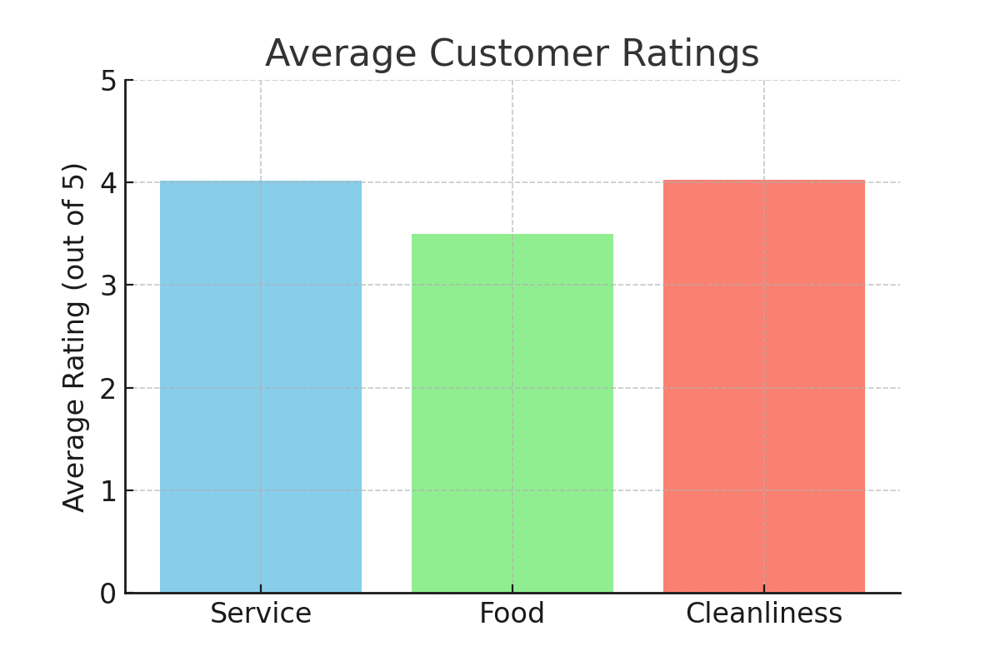
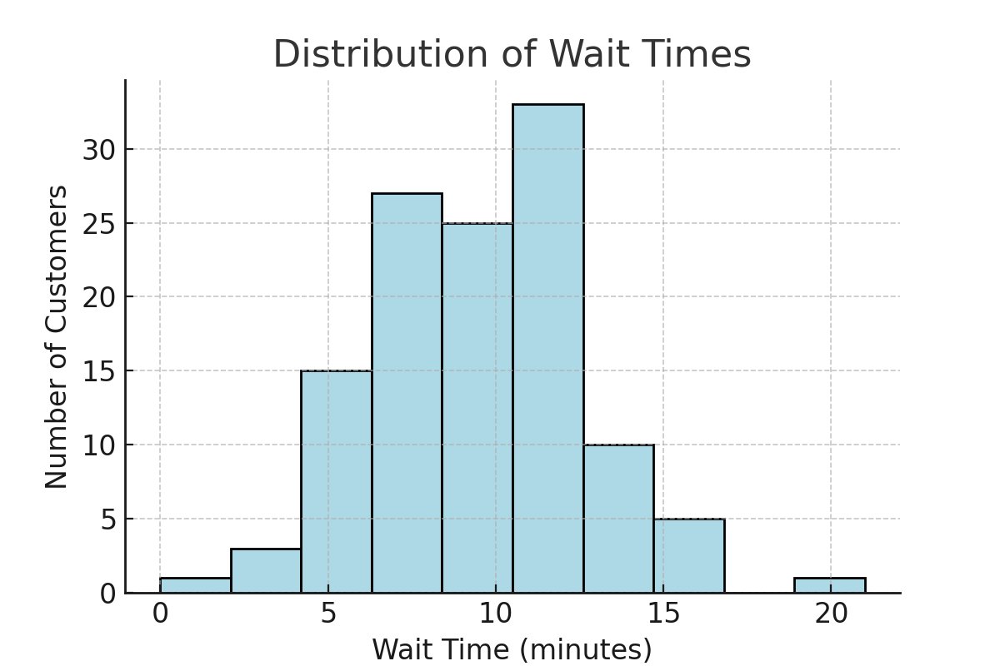
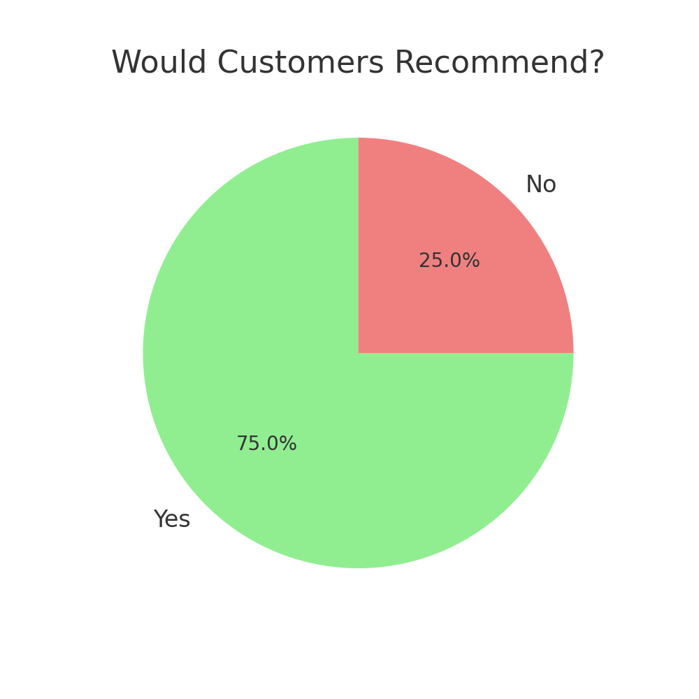

# Imaan-Ali-Projects
A collection of projects showcasing my skills in data analysis, problem-solving, and applied science/psychology.

---

# 📊 Project 1: Customer Satisfaction Analysis

### Goal  
Analyse customer satisfaction levels and identify factors influencing positive experiences.  

### Dataset  
120 survey responses including service, food, cleanliness ratings, wait times, and willingness to recommend.  

### Key Insights  
- Service rating: 4.0 / 5  
- Food rating: 3.6 / 5  
- Cleanliness rating: 4.2 / 5  
- 81% of customers said they would recommend the shop.  
- Longer wait times lowered satisfaction.  

### Skills Demonstrated  
- Data handling & organisation  
- Statistical analysis (averages, percentages)  
- Data visualisation (bar chart, histogram, pie chart)  
- Business insight & reporting  

### Files & Visuals
- `customer_satisfaction_dataset.csv` → raw dataset  
-  → Bar chart showing average scores for service, food, and cleanliness  
-  → Histogram showing distribution of customer wait times  
-  → Pie chart showing % of customers who would recommend the shop
