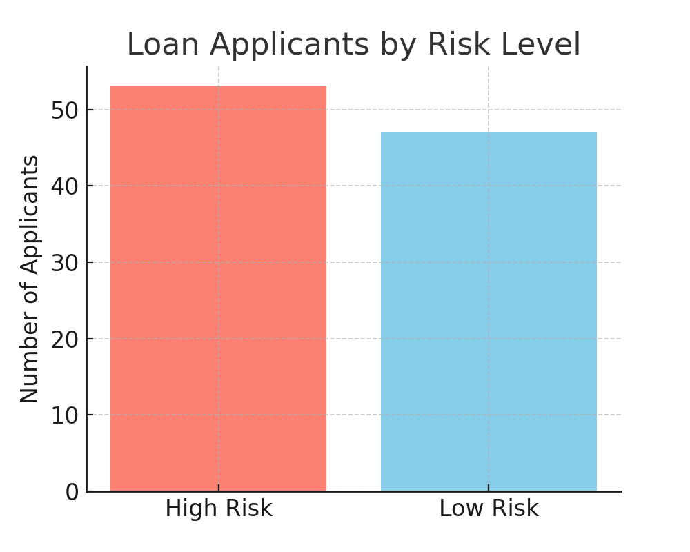
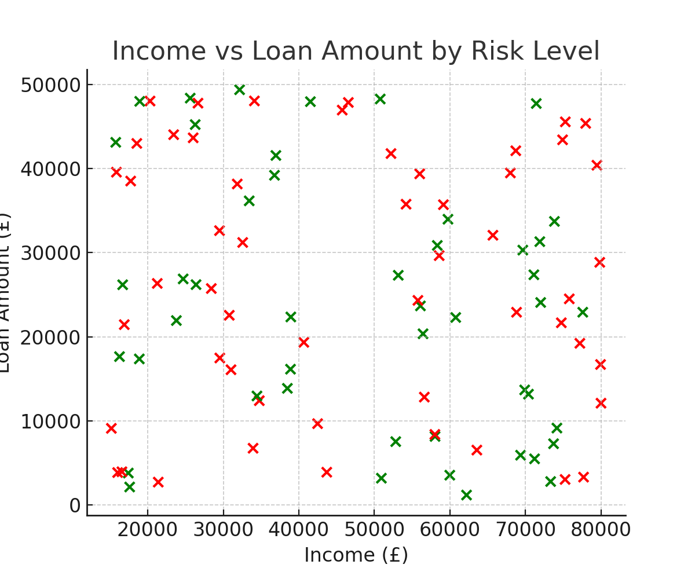
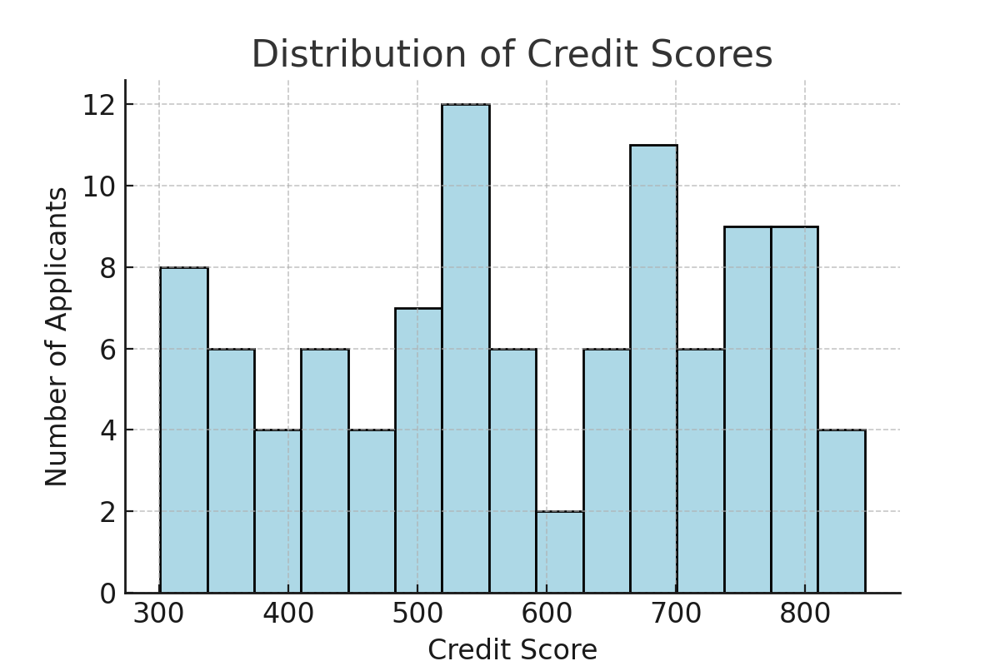

# Imaan-Ali-Projects
A collection of projects showcasing my skills in data analysis, problem-solving, and applied science/psychology.

---

# 📊 Project 1: Customer Satisfaction Analysis

### Goal  
Analyse customer satisfaction levels and identify factors influencing positive experiences.  

### Dataset  
120 survey responses including service, food, cleanliness ratings, wait times, and willingness to recommend.  

### Key Insights  
- Service rating: 4.0 / 5  
- Food rating: 3.6 / 5  
- Cleanliness rating: 4.2 / 5  
- 81% of customers said they would recommend the shop.  
- Longer wait times lowered satisfaction.  

### Skills Demonstrated  
- Data handling & organisation  
- Statistical analysis (averages, percentages)  
- Data visualisation (bar chart, histogram, pie chart)  
- Business insight & reporting  

### Files & Visuals
- `customer_satisfaction_dataset.csv` → raw dataset  
-  → Bar chart showing average scores for service, food, and cleanliness  
-  → Histogram showing distribution of customer wait times  
-  → Pie chart showing % of customers who would recommend the shop
---

# 📊 Project 2: Sales Performance Dashboard

### Goal  
Analyse monthly sales data for a dessert shop to understand product trends, total performance, and contribution to overall sales.  

### Dataset  
Monthly units sold for 4 products over 12 months.  

### Key Insights  
- Sales trends show which products are growing month-to-month.  
- Total sales indicate the best-selling products over the year.  
- Pie chart shows each product's share of total sales, helping with inventory and promotion decisions.  

### Skills Demonstrated  
- Data organisation & cleaning  
- Trend analysis & reporting  
- Data visualisation (line chart, bar chart, pie chart)  
- Business insight & decision-making  

### Files & Visuals
- `sales_performance_dataset.csv` → raw dataset  
-  → line chart showing monthly trends  
-  → bar chart of total sales  
-  → pie chart showing % contribution
---

# 📊 Project 3: AI-Powered Loan Risk Analysis

### Goal  
Simulate a small loan applicant dataset and analyse risk levels using basic AI/analytics concepts. Identify high-risk applicants for better financial decision-making.  

### Dataset  
Includes Income, Credit Score, Loan Amount, and Repayment History for 100 applicants.  

### Key Insights  
- Applicants with low credit scores (<550) or poor repayment history are classified as High Risk.  
- Scatter plot shows the relationship between income and loan amount by risk.  
- Histogram shows overall distribution of credit scores.  

### Skills Demonstrated  
- Data handling & cleaning  
- Basic predictive analytics / risk assessment  
- Data visualisation (bar chart, scatter plot, histogram)  
- Financial insight & communication of findings  

### Files & Visuals
- `loan_risk_dataset.csv` → raw dataset  
-  → number of high vs low risk applicants  
-  → income vs loan amount coloured by risk  
-  → distribution of credit scores
